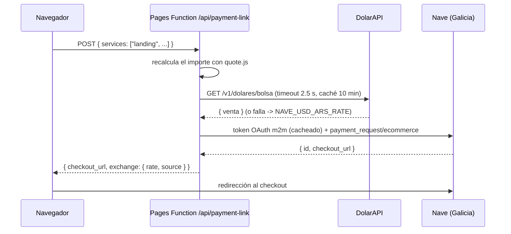

# Tars — Soluciones Digitales

Sitio comercial de un estudio web unipersonal de Mendoza (Argentina): presenta los servicios, arma presupuestos en el navegador, genera PDF y prepara cobros online con **Nave (Banco Galicia)** con conversión USD → ARS.

**Producción:** https://tars.com.ar · **Hosting:** Cloudflare Pages (estático + Pages Functions) · **Build:** ninguno (HTML, CSS y módulos ES nativos)

---

## Índice
1. [Qué resuelve](#qué-resuelve)
2. [Stack y decisiones](#stack-y-decisiones)
3. [Estructura del repositorio](#estructura-del-repositorio)
4. [Arquitectura del frontend](#arquitectura-del-frontend)
5. [Pagos con Nave y conversión USD → ARS](#pagos-con-nave-y-conversión-usd--ars)
6. [Seguridad](#seguridad)
7. [Experiencia de uso y accesibilidad](#experiencia-de-uso-y-accesibilidad)
8. [Rendimiento](#rendimiento)
9. [Tests](#tests)
10. [Operación: deploy, variables y tareas comunes](#operación-deploy-variables-y-tareas-comunes)
11. [Apéndice: material comercial](#apéndice-material-comercial)

---

## Qué resuelve
- **Vender:** landing con dirección de arte propia («Imprenta Riso», ver [`DESIGN.md`](DESIGN.md)), servicios, primeros proyectos, paquetes, FAQ, blog y contacto.
- **Cotizar al instante:** una «registradora» con teclas y ticket que suma servicios, separa pago único de abono mensual y arma el mensaje de WhatsApp.
- **Formalizar:** descarga del presupuesto en PDF; el mismo generador produce remitos.
- **Cobrar:** link de pago de Nave generado del lado del servidor, con el importe convertido a pesos con cotización en vivo y respaldo.
- **Medir:** eventos para Google Tag Manager (`quote_request`, `whatsapp_click`, `email_click`, `generate_lead`, `quote_pdf_download`, `begin_checkout`) y Core Web Vitals reales (`web_vitals`: LCP, CLS e INP con el elemento responsable en `debug_target`).

## Stack y decisiones
| Pieza | Elección | Por qué |
|---|---|---|
| Frontend | HTML + CSS + JavaScript (módulos ES nativos) | Sin build ni framework: menos piezas que mantener y carga mínima. |
| Code splitting | `import()` dinámico desde `js/main.js` | Cada página baja solo lo que usa. |
| Servidor | Cloudflare Pages Functions (`functions/`) | Las credenciales de pago nunca llegan al navegador. |
| PDF | jsPDF 3 autoalojado en `vendor/` | Se descarga solo al pedir un PDF (no pesa en la carga inicial). |
| Core Web Vitals | web-vitals 6 (build attribution) autoalojado en `vendor/` | Se carga después de `load`, en un momento ocioso: no toca el render ni el bloqueo del hilo. |
| Formulario | Formspree (con envío por `fetch` y respaldo clásico) | Sin servidor propio de correo. |
| Tests | Playwright (navegador) + tests en Node sin navegador | Cubre interfaz, lógica pura y servidor. |

## Estructura del repositorio
```
index.html, servicios.html, contacto.html, blog.html,
privacidad.html, gracias.html, 404.html     páginas
riso.css                                    estilos (tokens, componentes, temas)
js/
  main.js                                   entrada: núcleo + import() por página
  core.js                                   tema, menú, motor de scroll, botones magnéticos
  lib/quote.js                              catálogo de precios y cálculo (única fuente de verdad)
  lib/pdf.js                                modelo y dibujo de presupuesto/remito
  lib/payments.js                           cliente de /api/payment-link
  lib/toast.js, track.js, env.js            avisos, medición, utilidades
  features/                                 registradora, acciones del ticket, formulario, 404
functions/
  api/payment-link.js                       endpoint de cobros (Pages Function)
  _lib/nave.js                              cliente de Nave + cotización USD -> ARS
vendor/jspdf/                               jsPDF (MIT) autoalojado
vendor/web-vitals/                          web-vitals 6.2.2 (Apache 2.0) autoalojado
_headers                                    Caché del navegador por tipo de archivo (Cloudflare Pages)
fonts/                                      Big Shoulders Display + Libre Franklin (autoalojadas)
tests/                                      suite de Playwright
DESIGN.md, PRODUCT.md                       dirección de arte y verdades del producto
```

## Arquitectura del frontend
- **Núcleo en todas las páginas** (`js/core.js`): tema claro/oscuro recordado, menú «margen de impresión», motor de scroll y desregistro riso (un solo `requestAnimationFrame`, lecturas y escrituras separadas por cuadro, medidas cacheadas hasta un `resize`).
- **Funciones por página** con `import()` dinámico:

  | Si existe | Se carga | Páginas |
  |---|---|---|
  | `#ticket-form` | `features/register.js` + `features/ticket-actions.js` | inicio, servicios |
  | `#contact-form` | `features/contact-form.js` | contacto |
  | `.runaway-button` | `features/runaway.js` | 404 |
- **Lógica de negocio pura** en `js/lib/quote.js` (sin DOM): precios, totales, texto del total, mensaje de WhatsApp y datos de analítica. La usan el navegador, los tests y el servidor.

## Pagos con Nave y conversión USD → ARS



### Conversión híbrida USD → ARS
Los precios del sitio están en USD; Nave cobra en pesos. `getExchangeRate()` (`functions/_lib/nave.js`):

1. **Cotización en vivo:** [DolarAPI](https://dolarapi.com), endpoint `https://dolarapi.com/v1/dolares/bolsa` (dólar **MEP**; `/mep` no existe y da 404) o `oficial`, según `NAVE_RATE_SOURCE`. Se toma el valor **`venta`**: lo que le cuesta al cliente comprar esos dólares.
2. **Timeout estricto de 2.5 s:** `AbortController` más una carrera contra un temporizador propio, así corta aunque el servidor ignore la cancelación. Ninguna demora de la API bloquea la función.
3. **Caché en memoria de 10 minutos por instancia:** no se consulta DolarAPI en cada cobro.
4. **Respaldo silencioso:** ante falla de red, timeout, error HTTP, JSON inválido o valor no numérico, se usa `NAVE_USD_ARS_RATE`. Un problema de DolarAPI **no cancela** el cobro si hay respaldo.
5. **Control de cordura:** la cotización en vivo solo se acepta si está entre **1/3 y 3 veces** el respaldo. Frena datos corruptos o extremos sin descartar diferencias legítimas cuando el respaldo quedó viejo por la inflación.
6. **Trazabilidad:** la respuesta del cobro informa la cotización usada, por ejemplo `exchange: { rate: 1556, source: "dolarapi-mep" }` o `source: "env"`.

La única situación en la que no se genera el link es **DolarAPI caída y sin `NAVE_USD_ARS_RATE`**: no existe un valor seguro para cobrar y el endpoint responde un error genérico.

### Integración con Nave
- Autenticación OAuth máquina a máquina con token cacheado hasta un minuto antes de vencer.
- Creación del cobro con `POST {api}/payment_request/ecommerce` y la estructura de `seller.pos_id`, `transactions[].amount/products`, `buyer` y `additional_info.callback_url`.
- Endpoints y cuerpo tomados del plugin oficial [`nave-for-woocommerce`](https://wordpress.org/plugins/nave-for-woocommerce/). **Confirmalos con la documentación que entrega Nave al habilitar la integración** antes de cobrar en producción.
- Solo se cobra online lo de pago único; los servicios mensuales se coordinan por WhatsApp.
- **Modo simulado:** sin credenciales, el endpoint devuelve un link de prueba (`gracias.html?pago=simulado`) y no cobra nada.

## Seguridad
- **El cliente nunca controla los precios:** el navegador envía solo los ids de servicios; el importe se recalcula en la Pages Function con el catálogo de `quote.js`. Precios o importes enviados desde el navegador se ignoran (cubierto por tests).
- **Credenciales solo en el servidor:** `NAVE_CLIENT_SECRET` y el resto viven en variables de entorno de Cloudflare (como *Secret*), nunca en el repositorio ni en el navegador.
- **Validación de entrada:** tamaño máximo del pedido (4 KB), forma del JSON, servicios inexistentes descartados, email validado.
- **Errores opacos hacia afuera:** los fallos de Nave se registran en el log del servidor; al navegador llega un mensaje genérico, sin detalles internos ni secretos (cubierto por tests).
- **Apagado por defecto:** el botón «Pagar ahora» y el endpoint solo se habilitan con `NAVE_ENABLED=true`.
- **Avisos y mensajes del servidor** se insertan con `textContent`, nunca como HTML.

## Experiencia de uso y accesibilidad
- Contraste WCAG AA verificado en las 7 páginas y en los dos temas (medición sobre el render real).
- Las capas decorativas del efecto riso no se leen en voz alta (`content: attr(data-text) / ""`).
- Avisos (`js/lib/toast.js`) con botón de cerrar, máximo 3 a la vez, pausa con el mouse encima y errores anunciados con `role="alert"`.
- **Carrera corregida en los avisos:** antes, apretar **Escape** mientras un aviso todavía estaba entrando (antes de que terminara su animación) no lo cerraba. Ahora Esc cierra el último aviso que no se esté yendo, aunque esté entrando, y un aviso cerrado antes de su primer cuadro no reaparece.
- Estados de carga «imprimiendo» (franja tipo rodillo, `aria-busy`) en lugar de spinners.
- «Reducir movimiento» respetado: capas quietas, sin giros ni rebotes.
- Sin JavaScript, las acciones que lo necesitan (PDF, pago) no se muestran.

## Rendimiento
- JavaScript propio por página: **13.3 a 20.3 KB** (antes 26.5 KB en todas), gracias al code splitting.
- jsPDF (419 KB) solo se descarga al pedir un PDF.
- `content-visibility: auto` en secciones debajo del primer pantallazo.
- Fuentes autoalojadas con `preload`; GTM asíncrono.

## Tests
```bash
npm install
npx playwright install chromium
npm test
```
La suite corre en escritorio y en celular (Pixel 7) contra un servidor local. Las peticiones externas se bloquean o se simulan: ningún test sale a internet ni toca métricas reales.

| Área | Archivos |
|---|---|
| Sitio (carga, enlaces, SEO, menú, tema, formulario, scroll horizontal) | `tests/site.spec.js` |
| Avisos y estados de carga | `tests/ux.spec.js` |
| Carga diferida por página | `tests/perf.spec.js` |
| Lógica del presupuesto (Node) | `tests/quote.spec.js` |
| PDF, cobros y acciones del ticket | `tests/integrations.spec.js`, `tests/pdf.spec.js` |
| Endpoint de cobros y cotización USD → ARS (Node) | `tests/payments.spec.js` |

Los tests de lógica pura y de servidor corren una sola vez (no se repiten en celular); por eso el reporte muestra tests «salteados».

## Operación: deploy, variables y tareas comunes

### Deploy
Cloudflare Pages despliega automáticamente cada push a `main` (build command vacío, output directory `.`). Las Pages Functions de `functions/` se publican junto con el sitio. Este proyecto necesita Cloudflare Pages: en otro hosting (por ejemplo Netlify) el sitio funciona, pero los cobros no.

### Variables de entorno (Cloudflare Pages → Settings → Environment variables)
| Variable | Obligatoria | Descripción |
|---|---|---|
| `NAVE_ENABLED` | sí, para cobrar | `true` muestra «Pagar ahora» y habilita el endpoint. |
| `NAVE_ENV` | no | `sandbox` (por defecto) o `production`. |
| `NAVE_CLIENT_ID` | sí (Secret) | Credencial de Nave. |
| `NAVE_CLIENT_SECRET` | sí (Secret) | Credencial de Nave. |
| `NAVE_AUDIENCE` | sí (Secret) | Credencial de Nave. |
| `NAVE_POS_ID` | sí | Punto de venta de Nave. |
| `NAVE_USD_ARS_RATE` | **recomendada** | Cotización de respaldo USD → ARS. Mantenela cerca del valor real. |
| `NAVE_RATE_SOURCE` | no | `mep` (por defecto, endpoint `bolsa`) u `oficial`. |
| `NAVE_LIVE_RATE` | no | `false` para usar solo la cotización fija. |
| `NAVE_CURRENCY` | no | Moneda del cobro (`ARS` por defecto; con `USD` no se convierte). |
| `NAVE_NOTIFICATION_URL` | no | Webhook de avisos de pago. |

Sin las cuatro credenciales, el endpoint queda en **modo simulado**.

### Activar cobros (paso a paso)
1. Cargar las credenciales de **sandbox**, `NAVE_POS_ID` y `NAVE_USD_ARS_RATE`, con `NAVE_ENV=sandbox` y `NAVE_ENABLED=true`.
2. Hacer un cobro de prueba y revisar en la respuesta `exchange.source` (debería ser `dolarapi-mep`).
3. Confirmar con Nave los endpoints y el cuerpo del pedido.
4. Pasar a `NAVE_ENV=production` con las credenciales de producción.

### Tareas comunes
- **Cambiar un precio o sumar un servicio:** editar `CATALOG` en `js/lib/quote.js` y la tecla correspondiente (`data-service="id"`) en `index.html` y `servicios.html`. El servidor toma el cambio automáticamente.
- **Actualizar jsPDF:** `npm install` y `npm run vendor:jspdf`.
- **Volver atrás un deploy:** desde Cloudflare Pages → Deployments → «Rollback», o con `git revert` del commit en `main`.
- **Formulario:** Formspree con redirección a `gracias.html`, que es la página que cuenta la conversión.
- **Dominio propio:** agregarlo en Cloudflare Pages y apuntar un CNAME a `tars.com.ar`.

---

## Apéndice: material comercial
- **WhatsApp (cliente que pide propuesta):** «Hola, soy [Nombre] y quiero un sitio web para mi negocio de [tipo de negocio]. Busco una web que venda más y tenga contacto directo por WhatsApp. ¿Podés enviarme una propuesta?»
- **Publicación para redes:** «Lanzá tu web profesional con Tars. Diseño rápido, pensado para vender y desde USD 149. Contacto directo por WhatsApp.»
- **Instagram/Facebook:** «¿Querés una web que convierta? Tars hace sitios modernos para emprendedores, entrega rápido y responde en menos de 24 horas.»
- **Mensaje corto:** «Diseño web desde USD 149 para emprendedores que quieren vender más online. Contacto rápido por WhatsApp.»
